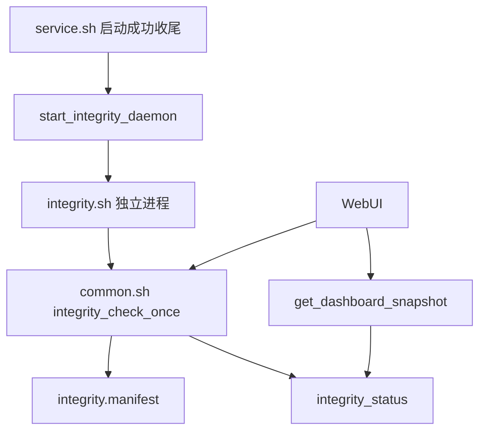

# RescueX 基础完整性自检设计

Feature Name: rescuex-integrity
Updated: 2026-07-22

## Description

在现有 RescueX 启动成功流程之后启动独立 `integrity.sh` 守护进程。守护进程使用共享库中的统一函数读取配置、生成基线、校验核心执行脚本并写入状态。动态更新的 `module.prop` 保持在基线之外。WebUI 通过现有 `get_dashboard_snapshot` 接口读取同一状态键值，手动检查直接调用 `integrity_check_once`。

## Architecture

## Components and Interfaces

- `common.sh`: 统一配置字段、哈希、基线、状态和进程检查函数。
- `integrity.sh`: 独立长期进程，首次检查后按随机间隔循环。
- `service.sh`: 仅在 `module.prop` 更新等收尾动作完成后拉起守护。
- `webroot/script.js`: 读取状态、渲染状态、保存开关并提供立即检查动作。
- `webroot/index.html`: 提供开关、状态卡片和立即检查按钮。

## Data Model

`integrity.manifest` 保存版本标记和 `<sha256>  <filename>`。`integrity_status` 保存 `RESULT`、`DETAIL`、`CHECKED_AT`。仪表盘输出使用 `INTEGRITY_` 前缀避免与启动状态字段冲突。

## Correctness Properties

- 基线文件仅包含存在且成功计算哈希的核心文件。
- 校验结果只由基线和当前文件内容决定。
- WebUI 展示字段来自后端快照，手动检查和周期检查调用同一校验函数。
- 完整性异常只产生状态和日志，当前阶段不改变其他模块状态。

## Error Handling

哈希工具不可用或基线无法生成时写入 `ERROR`。目标文件缺失或内容变化时写入 `COMPROMISED`。守护进程关闭时清理自身 PID 文件。

## Test Strategy

- 使用 `sh -n` 验证新增和修改 Shell 文件语法。
- 使用 `git diff --check` 检查补丁格式。
- 在 Android 设备上首次启动确认 `BASELINE_CREATED`，手动检查确认 `OK`，修改核心文件后确认 `COMPROMISED`。
- 在 WebUI 中切换开关并保存，确认 `config.conf` 和仪表盘状态同步。
